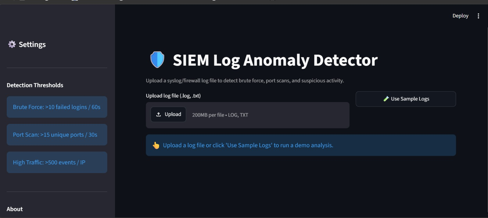

# 🛡️ SIEM Log Anomaly Detector

> A Python tool that automatically detects security threats in syslog and firewall-style log files — simulating the correlation-rule approach used in enterprise SIEM platforms such as **IBM QRadar** and **HP ArcSight**.

Built as a SOC analyst portfolio project by **Sai Sura** — Master's student in Intelligent Interactive Systems, Universität Bielefeld.


---

## 📸 Dashboard Preview



Text preview of the dashboard output:

```
╔══════════════════════════════════════════════════════════╗
║  🛡️  SIEM Log Anomaly Detector                          ║
║  ─────────────────────────────────────────────────────  ║
║  Total Events: 971   Alerts: 4   Severity: 🔴 HIGH      ║
║  ─────────────────────────────────────────────────────  ║
║                                                          ║
║  🔴 [HIGH]   Brute Force Attack                         ║
║              185.220.101.47 → 40 failed logins / 60s    ║
║                                                          ║
║  🟠 [MEDIUM] Port Scan Detected                         ║
║              45.33.32.156 → 30 ports / 30s              ║
║                                                          ║
║  🟠 [MEDIUM] High Traffic Volume                        ║
║              203.0.113.99 → 600 events                  ║
║                                                          ║
║  🟡 [LOW]    After-Hours Login Attempt                  ║
║              91.108.4.1 → login at 02:17                ║
║                                                          ║
║  [ 📥 Download Incident Report (JSON) ]                 ║
╚══════════════════════════════════════════════════════════╝
```

---

## 🎯 Problem This Solves

In a real Security Operations Center (SOC), analysts review **thousands of log lines per day** to find attack patterns. Doing this manually is slow, error-prone and does not scale.

This tool **automates the first-pass detection** — similar to what SIEM correlation rules do — using pure Python. An analyst can load a log file and immediately see which events need attention, with a severity level and a recommended action for each alert.

---

## ✨ Key Features

- **Log parsing** of syslog-style authentication and connection logs with regular expressions
- **4 detection rules** based on thresholds and time windows (brute force, port scan, high traffic, after-hours login)
- **Severity classification** (HIGH / MEDIUM / LOW) and an overall risk level per report
- **Recommended response actions** for every alert, written like a SOC playbook step
- **JSON incident reports** that are easy to store, share or send to other tools
- **Streamlit dashboard** to upload logs, view alerts and download the report
- **Sample log generator** that mixes realistic attack patterns into normal traffic for testing

---

## 🔍 What It Detects

| Threat | Detection Rule | Severity | Recommended Action |
|--------|----------------|----------|--------------------|
| **Brute Force Attack** | >10 failed logins from the same IP within 60 seconds | 🔴 HIGH | Block IP, review account lockout policy, enable MFA |
| **Port Scan** | >15 unique ports hit from the same IP within 30 seconds | 🟠 MEDIUM | Block IP at perimeter firewall, review IDS/IPS rules |
| **High Traffic / DDoS** | >500 events from a single IP in the analysed log | 🟠 MEDIUM | Investigate for DDoS or data exfiltration |
| **After-Hours Login** | Authentication attempt outside 08:00–18:00 | 🟡 LOW | Verify if legitimate; alert account owner |

---

## 🎯 MITRE ATT&CK Mapping

Each detection rule relates to a MITRE ATT&CK technique. This helps analysts describe alerts in the common language used by SOC teams.

| Detection | MITRE ATT&CK Technique | Tactic |
|-----------|------------------------|--------|
| Brute Force Attack | [T1110 – Brute Force](https://attack.mitre.org/techniques/T1110/) | Credential Access |
| Port Scan | [T1046 – Network Service Discovery](https://attack.mitre.org/techniques/T1046/) | Discovery |
| High Traffic / DDoS | [T1498 – Network Denial of Service](https://attack.mitre.org/techniques/T1498/) | Impact |
| After-Hours Login | [T1078 – Valid Accounts](https://attack.mitre.org/techniques/T1078/) (possible misuse) | Initial Access / Persistence |

> Note: after-hours logins are not always malicious. They are flagged as LOW severity so an analyst can verify them.

---

## 🏗️ Architecture

```
                         ┌─────────────────┐
                         │    Log File     │
                         │  (syslog / fw)  │
                         └────────┬────────┘
                                  │
                                  ▼
                         ┌─────────────────┐
                         │   Log Parser    │  ← Extracts: timestamp, IP,
                         │  (analyzer.py)  │    port, service, auth status
                         └────────┬────────┘
                                  │
         ┌───────────────┬────────┴───────┬────────────────┐
         ▼               ▼                ▼                ▼
┌────────────────┐ ┌──────────────┐ ┌──────────────┐ ┌──────────────┐
│  Brute Force   │ │  Port Scan   │ │ High Traffic │ │  After-Hours │
│   Detector     │ │   Detector   │ │   Detector   │ │   Detector   │
└───────┬────────┘ └──────┬───────┘ └──────┬───────┘ └──────┬───────┘
        └─────────────────┴────────┬───────┴────────────────┘
                                   ▼
                         ┌─────────────────┐
                         │ Report Generator│  ← JSON incident report
                         │                 │    with severity + actions
                         └────────┬────────┘
                                  │
                   ┌──────────────┴──────────────┐
                   ▼                             ▼
          ┌─────────────────┐           ┌─────────────────┐
          │   CLI Output    │           │    Streamlit    │
          │ (terminal view) │           │    Dashboard    │
          └─────────────────┘           └─────────────────┘
```

### How it works (step by step)

1. **Load** — the analyzer reads the log file line by line.
2. **Parse** — regular expressions extract the timestamp, source IP, destination port, service and authentication result from each line.
3. **Detect** — four detection functions check the parsed events against their thresholds and time windows (sliding window per source IP).
4. **Classify** — each alert gets a severity level; the highest alert severity becomes the overall report severity.
5. **Report** — alerts, counts, first/last seen times and recommended actions are written to a JSON incident report.
6. **Visualise** — results are shown in the terminal (CLI) or in the Streamlit dashboard.

---

## 🚀 Quick Start

### 1. Clone the repository
```bash
git clone https://github.com/surasai060/SIEM-log-anomaly-detector.git
cd SIEM-log-anomaly-detector
```

### 2. Install dependencies
```bash
pip install -r requirements.txt
```

### 3. Generate sample logs (with attack patterns embedded)
```bash
python generate_sample_logs.py
```
This creates `sample_logs/auth.log` with about 970 log entries, including a brute-force attack, a port scan and flood traffic mixed into normal traffic.

### 4a. Run the CLI analysis
```bash
python analyzer.py sample_logs/auth.log report.json
```

### 4b. Launch the Streamlit dashboard
```bash
streamlit run dashboard.py
```
Then open **http://localhost:8501** in your browser.

---

## 📊 Sample Output (CLI)

```
[*] Loading logs from: sample_logs/auth.log
[*] Parsed 971 log events
[*] Running detection engines...
[*] Report saved to: report.json

==================================================
  OVERALL SEVERITY: HIGH
  Alerts Found:     4
==================================================

  [HIGH] Brute Force Attack
  Source IP : 185.220.101.47
  Details   : 40 failed login attempts from 185.220.101.47 within 60s
  Action    : Block IP, review account lockout policy, enable MFA

  [MEDIUM] Port Scan
  Source IP : 45.33.32.156
  Details   : 45.33.32.156 scanned 30 unique ports within 30s
  Action    : Block IP at perimeter firewall, review IDS/IPS rules

  [MEDIUM] High Traffic Volume
  Source IP : 203.0.113.99
  Details   : 203.0.113.99 generated 600 log events (threshold: 500)
  Action    : Investigate for DDoS or data exfiltration

  [LOW] After-Hours Login Attempt
  Source IP : 91.108.4.1
  Details   : Authentication attempt at 02:17 (outside business hours)
  Action    : Verify if legitimate; alert account owner
```

---

## 📄 Sample Incident Report (JSON)

```json
{
  "report_metadata": {
    "tool": "SIEM Log Anomaly Detector",
    "generated_at": "2026-06-27 14:32:01",
    "total_events_analyzed": 971,
    "total_alerts": 4,
    "overall_severity": "HIGH"
  },
  "executive_summary": "4 anomalies detected across 971 log events. Overall risk level: HIGH.",
  "alerts": [
    {
      "type": "Brute Force Attack",
      "severity": "HIGH",
      "src_ip": "185.220.101.47",
      "count": 40,
      "first_seen": "2026-06-27 09:30:00",
      "last_seen": "2026-06-27 09:30:45",
      "recommendation": "Block IP, review account lockout policy, enable MFA"
    }
  ]
}
```

---

## 🕵️ How a SOC Analyst Would Use the Results

Example for the brute-force alert above:

1. **Validate** — confirm the 40 failed logins in the raw log lines for `185.220.101.47`.
2. **Check success** — did any login from this IP **succeed** after the failures? A success means possible account compromise and must be escalated.
3. **Enrich** — check the IP reputation (e.g., VirusTotal, AbuseIPDB) and its country/hosting provider.
4. **Scope** — are other servers or accounts targeted by the same IP?
5. **Respond** — block the IP, check the targeted account, enforce MFA, and document the case.

---

## 📁 Project Structure

```
SIEM-log-anomaly-detector/
│
├── analyzer.py                 # Core detection engine
│   ├── Log Parser              #   Parses raw syslog lines
│   ├── Brute Force Detector    #   Threshold: >10 failures / 60s
│   ├── Port Scan Detector      #   Threshold: >15 ports / 30s
│   ├── High Traffic Detector   #   Threshold: >500 events / IP
│   ├── After-Hours Detector    #   Outside 08:00–18:00
│   └── Report Generator        #   JSON incident report
│
├── dashboard.py                # Streamlit web dashboard
├── generate_sample_logs.py     # Test log generator with embedded attacks
├── requirements.txt            # Python dependencies
├── images/
│   └── dashboard.png           # Dashboard screenshot
└── sample_logs/
    └── auth.log                # Generated test data
```

---

## 🔗 How This Relates to Real SIEM Tools

| This Project | Similar QRadar / ArcSight Concept |
|---|---|
| `detect_brute_force()` | Authentication-failure correlation rule |
| `detect_port_scan()` | Port-scan / reconnaissance correlation rule |
| `detect_high_traffic()` | Traffic or flow volume anomaly rule |
| Thresholds + time windows | Rule conditions (e.g., "X events within Y seconds") |
| JSON incident report | QRadar Offense / ArcSight Case |
| Severity: HIGH / MEDIUM / LOW | QRadar Magnitude / ArcSight Priority |

---

## ⚠️ Limitations

This is a learning and portfolio project, not a production SIEM:

- Works on **single log files**, not live log streams from many sources.
- Uses **fixed thresholds**; real SIEMs tune rules per environment to reduce false positives.
- The high-traffic rule counts events per IP across the **whole file**, without a time window.
- Tested with **generated sample logs**; real log formats may need parser changes.
- No **log normalisation** across different vendors (a real SIEM normalises fields, e.g., CEF or CIM).

---

## 🗺️ Roadmap

- [ ] Add a time window to the high-traffic rule (e.g., >500 events within 5 minutes)
- [ ] Add a `mitre_technique` field to every alert in the JSON report
- [ ] Detect **successful login after failed attempts** (brute force success)
- [ ] Move thresholds into a configuration file (`config.yaml`)
- [ ] Support more log formats (Windows Event Logs, Apache/Nginx access logs)
- [ ] Add IP reputation enrichment with the AbuseIPDB or VirusTotal API
- [ ] Add unit tests for each detection rule

---

## 🛠️ Tech Stack

- **Python 3.x** — log parsing, detection logic, report generation
- **Regex** — log line pattern matching
- **JSON** — structured incident report output
- **Streamlit** — interactive web dashboard

---

## 👤 Author

**Sai Sura**  
Master's student in Intelligent Interactive Systems — Universität Bielefeld  
Background in SOC operations: alert triage, log analysis and incident response  
📧 surasai060@gmail.com  
🔗 [LinkedIn](https://linkedin.com/in/sai-sura-945032284) · [GitHub](https://github.com/surasai060)

---

## 📜 License

MIT License — free to use, modify, and distribute.
